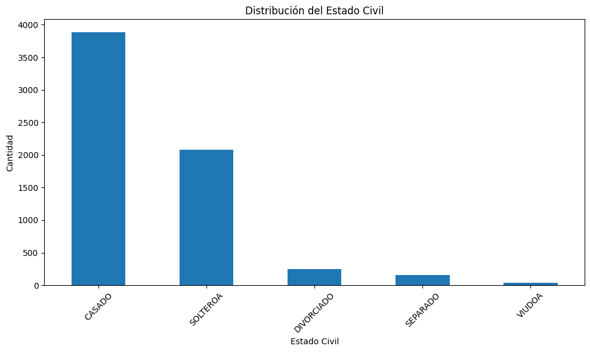
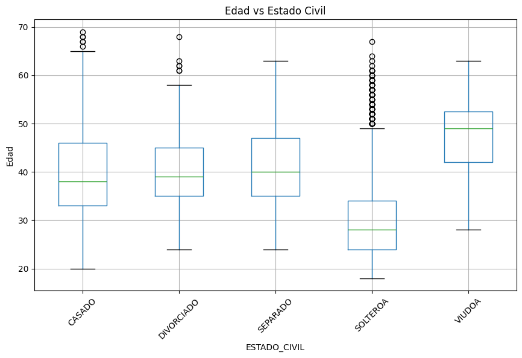
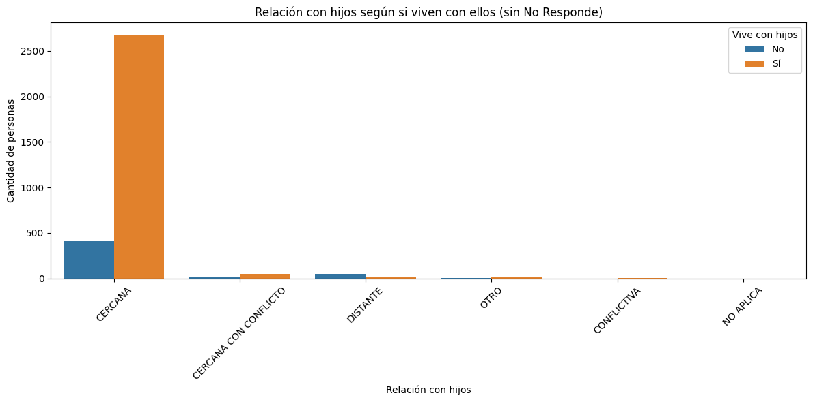

# **Análisis Familiar**

**Responsabilidades:**

*   Explorar variables relacionadas con familia
*   Analizar estado civil, hijos, convivencia
*   Identificar patrones familiares


```python
# analisis_familiar.py
import pandas as pd
import matplotlib.pyplot as plt
import scipy.stats as stats
import seaborn as sns
```


```python
#Conectar a drive
from google.colab import drive
drive.mount('/content/drive')
```

    Mounted at /content/drive
    


```python
# Leer los datos
df = pd.read_excel('/content/drive/MyDrive/Python/JEFAB_2024_limpio.xlsx')
```


```python
# Explorar estructura básica
print("=== INFORMACIÓN GENERAL ===")
print(f"Total de registros: {len(df)}")
print(f"Total de columnas: {len(df.columns)}")
```

    === INFORMACIÓN GENERAL ===
    Total de registros: 6423
    Total de columnas: 61
    

# **Preguntas**
1. ¿Qué porcentaje del personal está casado?
2. ¿Cuántos tienen hijos y cuántos viven con ellos?
3. ¿Hay relación entre edad y estado civil?

# **1. ¿Qué porcentaje del personal está casado?**


```python
# Análisis de estado civil
print("=== ANÁLISIS ESTADO CIVIL ===")
print(df['ESTADO_CIVIL'].value_counts())
```

    === ANÁLISIS ESTADO CIVIL ===
    ESTADO_CIVIL
    CASADO        3889
    SOLTEROA      2084
    DIVORCIADO     250
    SEPARADO       161
    VIUDOA          39
    Name: count, dtype: int64
    


```python
# Porcentaje de personas segun su estado civil
print("\n=== PROPORCION POR ESTADO CIVIL===")
print(df['ESTADO_CIVIL'].value_counts(normalize=True) * 100)
```

    
    === PROPORCION POR ESTADO CIVIL===
    ESTADO_CIVIL
    CASADO        60.548031
    SOLTEROA      32.445898
    DIVORCIADO     3.892262
    SEPARADO       2.506617
    VIUDOA         0.607193
    Name: proportion, dtype: float64
    


```python
# Gráfico de estado civil
plt.figure(figsize=(10, 6))
df['ESTADO_CIVIL'].value_counts().plot(kind='bar')
plt.title('Distribución del Estado Civil')
plt.xlabel('Estado Civil')
plt.ylabel('Cantidad')
plt.xticks(rotation=45)
plt.tight_layout()
plt.show()
```


    

    


En este caso el estado civil muestra que la mayor proporción del personal se encuentra casado, con un 60,5% del total. En segundo lugar, se encuentran las personas solteras con un 32,4%. Los demás estados civiles presentan una participación significativamente menor: divorciados (3,9%), separados (2,5%) y viudos/as (0,6%). Estos resultados indican que la mayoría de la población encuestada se compone de individuos casados.

# **2. ¿Cuántos tienen hijos y cuántos viven con ellos?**


```python
# Cantidad de personas con o sin hijos
print("\n=== ANÁLISIS DE HIJOS ===")
print(f"Personal con hijos: {df['HIJOS'].value_counts()}")
```

    
    === ANÁLISIS DE HIJOS ===
    Personal con hijos: HIJOS
    SI    3669
    NO    2754
    Name: count, dtype: int64
    


```python
# Porcentaje de personas con o sin hijos
print("\n=== PROPORCION DE PERSONAS CON HIJOS ===")
print(df['HIJOS'].value_counts(normalize=True) * 100)
```

    
    === PROPORCION DE PERSONAS CON HIJOS ===
    HIJOS
    SI    57.12284
    NO    42.87716
    Name: proportion, dtype: float64
    


```python
# Cantidad de personas con hijos que viven en el hogar
print("\n=== ANÁLISIS DE HIJOS EN HOGAR ===")
print(f"Personal con hijos en hogar:\n{df['HIJOS_EN_HOGAR'].value_counts(normalize=True)*100}")
```

    
    === ANÁLISIS DE HIJOS EN HOGAR ===
    Personal con hijos en hogar:
    HIJOS_EN_HOGAR
    0.00000    50.365873
    1.00000    24.163164
    2.00000    16.082827
    1.27552     6.943796
    3.00000     2.148529
    4.00000     0.249105
    5.00000     0.046707
    Name: proportion, dtype: float64
    

Para la variables hijos y convivencia familiar, observamos que el 57,1% del personal tiene hijos. Sin embargo, vemos que de las personas encuestadas el 50.4% no cuenta con sus hijos en el hogar.
 Estos hallazgos sugieren que, aunque la mayoría de los trabajadores son padres, no todos comparten residencia con sus hijos, lo cual puede estar asociado a factores como la independencia residencial, arreglos de custodia o dinámicas familiares particulares.

# **3. ¿Hay relación entre edad y estado civil?**


```python
# Promedio de edad por estado civil
print("\n=== Edad promedio por Estado Civil ===")
print(df.groupby('ESTADO_CIVIL')['EDAD2'].mean())
```

    
    === Edad promedio por Estado Civil ===
    ESTADO_CIVIL
    CASADO        39.681089
    DIVORCIADO    40.352000
    SEPARADO      40.875776
    SOLTEROA      30.233012
    VIUDOA        47.564103
    Name: EDAD2, dtype: float64
    


```python
# Distribución por edad y estado civil
df.boxplot(column='EDAD2', by='ESTADO_CIVIL', figsize=(10,6))
plt.title("Edad vs Estado Civil")
plt.suptitle("")
plt.ylabel("Edad")
plt.xticks(rotation=45)
plt.show()
```


    

    


El análisis de la relación entre edad y estado civil evidencia patrones claros. Las personas solteras presentan la edad promedio más baja (30,2 años), mientras que los casados, divorciados y separados registran promedios similares (entre 39 y 41 años). Finalmente, los viudos/as se ubican como el grupo de mayor edad promedio, con 47,5 años.
La visualización mediante el diagrama de caja confirma que los solteros concentran edades jóvenes, mientras que la viudez aparece asociada a edades mayores. Por lo que podriamos indicar que sí existe una relación entre la edad y el estado civil, donde las etapas del ciclo vital influyen en la condición marital predominante

# Hallazgos adicionales


```python
# Crear variable booleana: tiene hijos en hogar o no
df['HIJOS_EN_HOGAR_BIN'] = df['HIJOS_EN_HOGAR'] > 0

# Tabla de contingencia
tabla = pd.crosstab(df['HIJOS_EN_HOGAR_BIN'], df['RELACION_HIJOS'])

# Prueba Chi-cuadrado
chi2, p, dof, ex = stats.chi2_contingency(tabla)

print("Tabla de contingencia:\n", tabla)
print(f"\nChi-cuadrado = {chi2:.3f}, p-valor = {p:.3f}")

if p < 0.05:
    print("Existe asociación significativa entre tener hijos en hogar y la relación con ellos.")
else:
    print("No hay asociación significativa entre tener hijos en hogar y la relación con ellos.")

```

    Tabla de contingencia:
     RELACION_HIJOS      CERCANA  CERCANA CON CONFLICTO  CONFLICTIVA  DISTANTE  \
    HIJOS_EN_HOGAR_BIN                                                          
    False                   412                     13            0        47   
    True                   2681                     52            3        13   
    
    RELACION_HIJOS      NO APLICA  NO RESPONDE  OTRO  
    HIJOS_EN_HOGAR_BIN                                
    False                       1         2754     8  
    True                        0          427    12  
    
    Chi-cuadrado = 3414.098, p-valor = 0.000
    Existe asociación significativa entre tener hijos en hogar y la relación con ellos.
    


```python
# Filtrar para quitar la categoría "NO RESPONDE" en RELACION_HIJOS
df_filtrado = df[df['RELACION_HIJOS'] != "NO RESPONDE"]

# Gráfico de barras apiladas o countplot sin "NO RESPONDE"
plt.figure(figsize=(12, 6))
sns.countplot(data=df_filtrado, x='RELACION_HIJOS', hue='HIJOS_EN_HOGAR_BIN')
plt.title('Relación con hijos según si viven con ellos (sin No Responde)')
plt.xlabel('Relación con hijos')
plt.ylabel('Cantidad de personas')
plt.xticks(rotation=45)
plt.legend(title='Vive con hijos', labels=['No', 'Sí'])
plt.tight_layout()
plt.show()
```


    

    


El análisis muestra una asociación significativa entre tener hijos en el hogar y el tipo de relación con ellos, según la prueba Chi-cuadrado (chi2 = 3414.098, p < 0.001). Esto indica que la calidad o tipo de relación con los hijos varía dependiendo de si los hijos viven o no en el hogar.

La tabla de contingencia y el gráfico apoyan estos resultados:

Las personas que tienen hijos en el hogar reportan mayoritariamente una relación "CERCANA".

Las personas sin hijos en el hogar tienen un alto porcentaje que "NO RESPONDE" o reportan relaciones "DISTANTES".

Este resultado es relevante para entender la dinámica familiar y cómo la convivencia afecta la relación parental.
