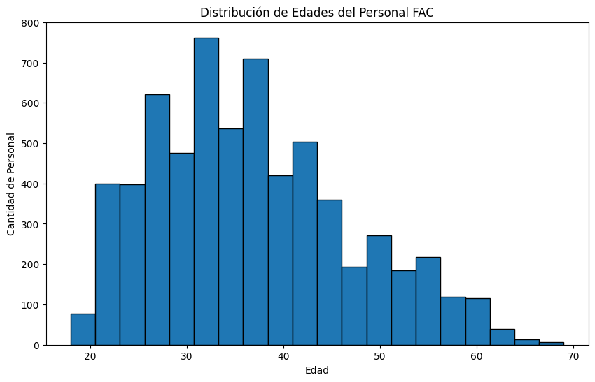
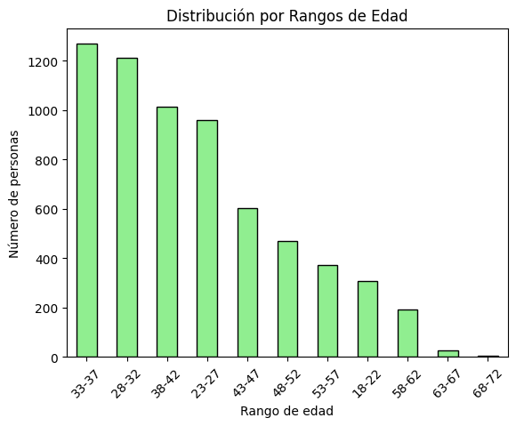
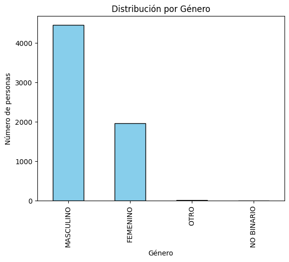
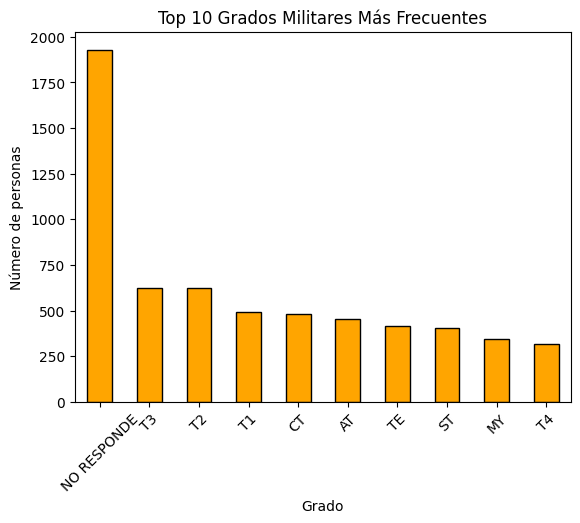
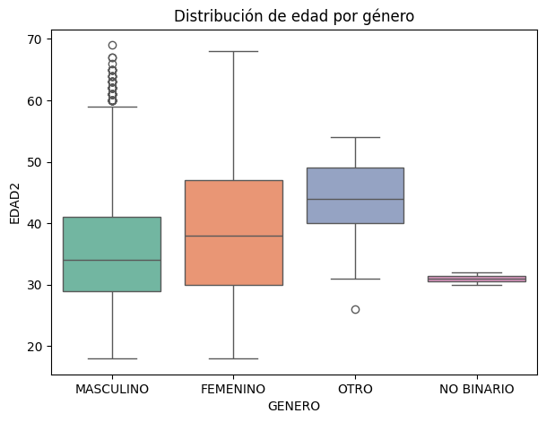
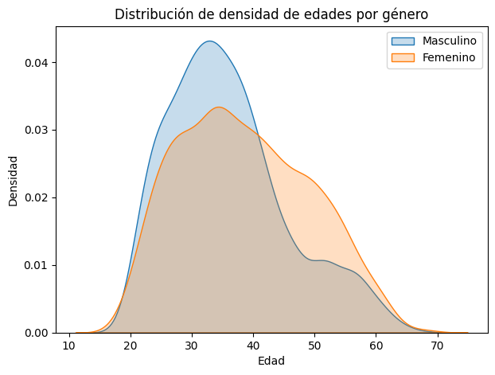
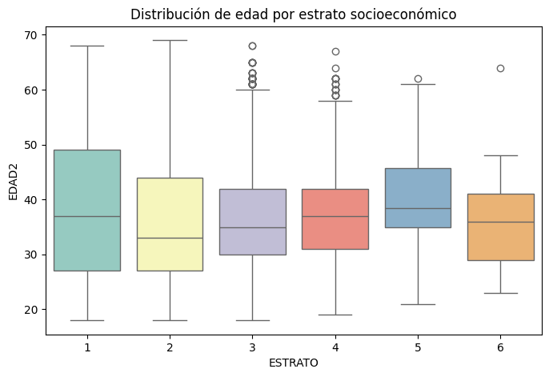
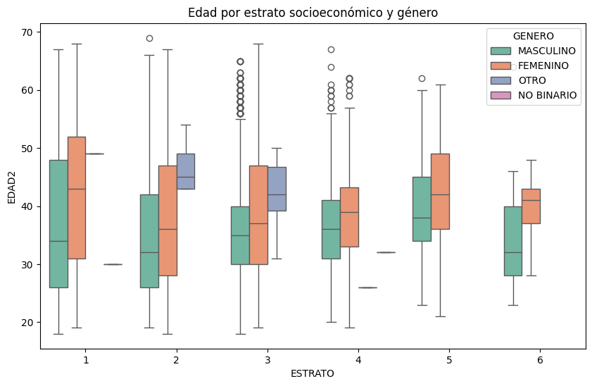

<a href="https://colab.research.google.com/github/yuneidy1703-png/Analisis-datos-fac-equipo-Yun/blob/main/Reportes/Analisis_demografico.ipynb" target="_parent"></a>

# **Análisis Demográfico**

**Responsabilidades:**

*   Explorar las columnas básicas de demografía
*   Crear visualizaciones simples de edad, género, rango
*   Documentar hallazgos principales


```python
#Demografia basica.py
#Librerias
import pandas as pd
import matplotlib.pyplot as plt
from scipy.stats import ttest_ind, chi2_contingency
import seaborn as sns
```


```python
#Conectar a drive
from google.colab import drive
drive.mount('/content/drive')
```

    Drive already mounted at /content/drive; to attempt to forcibly remount, call drive.mount("/content/drive", force_remount=True).
    


```python
# Leer los datos
df = pd.read_excel('/content/drive/MyDrive/Python/JEFAB_2024_limpio.xlsx')
```


```python
# Explorar estructura básica
print("=== INFORMACIÓN GENERAL ===")
print(f"Total de registros: {len(df)}")
print(f"Total de columnas: {len(df.columns)}")
```

    === INFORMACIÓN GENERAL ===
    Total de registros: 6423
    Total de columnas: 61
    

# **Preguntas**
1. ¿Cuál es el rango de edad más común?
2. ¿Hay diferencias en la distribución por género?
3. ¿Cuál es el grado militar más frecuente?

# **1. ¿Cuál es el rango de edad más común?**


```python
#  1.¿Cuál es el rango de edad más común?
# Retomamos el analisis de edad
print("\n=== RANGO DE EDAD MÁS COMÚN ===")
print("Promedio:", df['EDAD2'].mean().round(1))
print("Mínima:", df['EDAD2'].min())
print("Máxima:", df['EDAD2'].max())
```

    
    === RANGO DE EDAD MÁS COMÚN ===
    Promedio: 36.7
    Mínima: 18.0
    Máxima: 69.0
    


```python
# Gráfico de edades
plt.figure(figsize=(10, 6))
plt.hist(df['EDAD2'], bins=20, edgecolor='black')
plt.title('Distribución de Edades del Personal FAC')
plt.xlabel('Edad')
plt.ylabel('Cantidad de Personal')
plt.show()
```


    

    


```python
# --- Transformar EDAD_RANGO ---
def transformar_rango(valor):
    if pd.isna(valor):
        return None
    val_str = str(valor)
    if len(val_str) == 4:  # ej: "1822"
        return f"{val_str[:2]}-{val_str[2:]}"
    elif len(val_str) == 5:  # ej: "3842"
        return f"{val_str[:2]}-{val_str[2:]}"
    return val_str

df["EDAD_RANGO_LIMPIO"] = df["EDAD_RANGO"].apply(transformar_rango)
```


```python
# Con la columna EDAD_RANGO ya categorizada
print("Rango más común:", df['EDAD_RANGO_LIMPIO'].mode()[0])
print(df['EDAD_RANGO_LIMPIO'].value_counts())
```

    Rango más común: 33-37
    EDAD_RANGO_LIMPIO
    33-37    1267
    28-32    1211
    38-42    1012
    23-27     958
    43-47     601
    48-52     470
    53-57     371
    18-22     309
    58-62     194
    63-67      26
    68-72       4
    Name: count, dtype: int64
    


```python
print("\n=== PROPORCION POR RANGO DE EDAD ===")
print(df['EDAD_RANGO_LIMPIO'].value_counts(normalize=True) * 100)
```

    
    === PROPORCION POR RANGO DE EDAD ===
    EDAD_RANGO_LIMPIO
    33-37    19.725985
    28-32    18.854118
    38-42    15.755877
    23-27    14.915149
    43-47     9.356998
    48-52     7.317453
    53-57     5.776117
    18-22     4.810836
    58-62     3.020395
    63-67     0.404795
    68-72     0.062276
    Name: proportion, dtype: float64
    


```python
# Gráfico
df['EDAD_RANGO_LIMPIO'].value_counts().plot(kind='bar', color='lightgreen', edgecolor='black')
plt.title("Distribución por Rangos de Edad")
plt.xlabel("Rango de edad")
plt.ylabel("Número de personas")
plt.xticks(rotation=45)
plt.show()
```


    

    


De esta manera podemos indicar que el rango de edad mas comun en nuestra base de datos es de 33-37 años con una edad promedio de 36.7 años

# **2. ¿Hay diferencias en la distribución por género?**


```python
# 2. ¿Hay diferencias en la distribución por género?
print("\n=== DISTRIBUCIÓN POR GÉNERO ===")
print(df['GENERO'].value_counts(normalize=True) * 100)
```

    
    === DISTRIBUCIÓN POR GÉNERO ===
    GENERO
    MASCULINO     69.297836
    FEMENINO      30.437490
    OTRO           0.233536
    NO BINARIO     0.031138
    Name: proportion, dtype: float64
    


```python
# Análisis de género
print("\n=== ANÁLISIS DE GÉNERO ===")
print(df['GENERO'].value_counts())
```

    
    === ANÁLISIS DE GÉNERO ===
    GENERO
    MASCULINO     4451
    FEMENINO      1955
    OTRO            15
    NO BINARIO       2
    Name: count, dtype: int64
    


```python
# Gráfico
df['GENERO'].value_counts().plot(kind='bar', color='skyblue', edgecolor='black')
plt.title("Distribución por Género")
plt.xlabel("Género")
plt.ylabel("Número de personas")
plt.show()
```


    

    


En cuanto a la variable género, se observa un claro predominio del genero masculino dentro de la muestra, seguido por el femenino en menor proporción. Las categorías “Otro” y “No binario” tienen una baja participación.

# **3. ¿Cuál es el grado militar más frecuente?**


```python
# 3. ¿Cuál es el grado militar más frecuente?
print("\n=== GRADO MILITAR MÁS FRECUENTE ===")
print("Grado más frecuente:", df['GRADO'].mode()[0])
print(df['GRADO'].value_counts().head())
```

    
    === GRADO MILITAR MÁS FRECUENTE ===
    Grado más frecuente: NO RESPONDE
    GRADO
    NO RESPONDE    1929
    T3              622
    T2              621
    T1              491
    CT              483
    Name: count, dtype: int64
    


```python
# Gráfico
df['GRADO'].value_counts().head(10).plot(kind='bar', color='orange', edgecolor='black')
plt.title("Top 10 Grados Militares Más Frecuentes")
plt.xlabel("Grado")
plt.ylabel("Número de personas")
plt.xticks(rotation=45)
plt.show()
```


    

    


La categoría más frecuente fue “No responde”, lo que evidencia un vacío de información en los registros. Entre quienes reportaron su rango, predominan los grados técnicos (T3 y T2), lo cual refleja que gran parte del personal encuestado corresponde a suboficiales técnicos en diferentes niveles. Los grados de oficiales aparecen en menor proporción.


```python
# Revisar relación entre CATEGORIA y GRADO
pd.crosstab(df['CATEGORIA'], df['GRADO']).head(10)
```


  <div id="df-ddf0c307-7f94-4bb3-a045-0b44d462d651" class="colab-df-container">
    <div>
<style scoped>
    .dataframe tbody tr th:only-of-type {
        vertical-align: middle;
    }

    .dataframe tbody tr th {
        vertical-align: top;
    }

    .dataframe thead th {
        text-align: right;
    }
</style>
<table border="1" class="dataframe">
  <thead>
    <tr style="text-align: right;">
      <th>GRADO</th>
      <th>AT</th>
      <th>BG</th>
      <th>CR</th>
      <th>CT</th>
      <th>GR</th>
      <th>MG</th>
      <th>MY</th>
      <th>NO RESPONDE</th>
      <th>ST</th>
      <th>T1</th>
      <th>T2</th>
      <th>T3</th>
      <th>T4</th>
      <th>TC</th>
      <th>TE</th>
      <th>TJ</th>
      <th>TJC</th>
      <th>TS</th>
    </tr>
    <tr>
      <th>CATEGORIA</th>
      <th></th>
      <th></th>
      <th></th>
      <th></th>
      <th></th>
      <th></th>
      <th></th>
      <th></th>
      <th></th>
      <th></th>
      <th></th>
      <th></th>
      <th></th>
      <th></th>
      <th></th>
      <th></th>
      <th></th>
      <th></th>
    </tr>
  </thead>
  <tbody>
    <tr>
      <th>CIVIL</th>
      <td>0</td>
      <td>0</td>
      <td>0</td>
      <td>0</td>
      <td>0</td>
      <td>0</td>
      <td>0</td>
      <td>1929</td>
      <td>0</td>
      <td>0</td>
      <td>0</td>
      <td>0</td>
      <td>0</td>
      <td>0</td>
      <td>0</td>
      <td>0</td>
      <td>0</td>
      <td>0</td>
    </tr>
    <tr>
      <th>OFICIAL</th>
      <td>0</td>
      <td>5</td>
      <td>47</td>
      <td>483</td>
      <td>1</td>
      <td>1</td>
      <td>343</td>
      <td>0</td>
      <td>406</td>
      <td>1</td>
      <td>0</td>
      <td>1</td>
      <td>0</td>
      <td>140</td>
      <td>416</td>
      <td>0</td>
      <td>0</td>
      <td>0</td>
    </tr>
    <tr>
      <th>SUBOFICIAL</th>
      <td>453</td>
      <td>0</td>
      <td>1</td>
      <td>0</td>
      <td>0</td>
      <td>1</td>
      <td>0</td>
      <td>0</td>
      <td>0</td>
      <td>490</td>
      <td>621</td>
      <td>621</td>
      <td>319</td>
      <td>0</td>
      <td>0</td>
      <td>61</td>
      <td>11</td>
      <td>72</td>
    </tr>
  </tbody>
</table>
</div>
    <div class="colab-df-buttons">

  <div class="colab-df-container">
    <button class="colab-df-convert" onclick="convertToInteractive('df-ddf0c307-7f94-4bb3-a045-0b44d462d651')"
            title="Convert this dataframe to an interactive table."
            style="display:none;">

  <svg xmlns="http://www.w3.org/2000/svg" height="24px" viewBox="0 -960 960 960">
    <path d="M120-120v-720h720v720H120Zm60-500h600v-160H180v160Zm220 220h160v-160H400v160Zm0 220h160v-160H400v160ZM180-400h160v-160H180v160Zm440 0h160v-160H620v160ZM180-180h160v-160H180v160Zm440 0h160v-160H620v160Z"/>
  </svg>
    </button>

  <style>
    .colab-df-container {
      display:flex;
      gap: 12px;
    }

    .colab-df-convert {
      background-color: #E8F0FE;
      border: none;
      border-radius: 50%;
      cursor: pointer;
      display: none;
      fill: #1967D2;
      height: 32px;
      padding: 0 0 0 0;
      width: 32px;
    }

    .colab-df-convert:hover {
      background-color: #E2EBFA;
      box-shadow: 0px 1px 2px rgba(60, 64, 67, 0.3), 0px 1px 3px 1px rgba(60, 64, 67, 0.15);
      fill: #174EA6;
    }

    .colab-df-buttons div {
      margin-bottom: 4px;
    }

    [theme=dark] .colab-df-convert {
      background-color: #3B4455;
      fill: #D2E3FC;
    }

    [theme=dark] .colab-df-convert:hover {
      background-color: #434B5C;
      box-shadow: 0px 1px 3px 1px rgba(0, 0, 0, 0.15);
      filter: drop-shadow(0px 1px 2px rgba(0, 0, 0, 0.3));
      fill: #FFFFFF;
    }
  </style>

    <script>
      const buttonEl =
        document.querySelector('#df-ddf0c307-7f94-4bb3-a045-0b44d462d651 button.colab-df-convert');
      buttonEl.style.display =
        google.colab.kernel.accessAllowed ? 'block' : 'none';

      async function convertToInteractive(key) {
        const element = document.querySelector('#df-ddf0c307-7f94-4bb3-a045-0b44d462d651');
        const dataTable =
          await google.colab.kernel.invokeFunction('convertToInteractive',
                                                    [key], {});
        if (!dataTable) return;

        const docLinkHtml = 'Like what you see? Visit the ' +
          '<a target="_blank" href=https://colab.research.google.com/notebooks/data_table.ipynb>data table notebook</a>'
          + ' to learn more about interactive tables.';
        element.innerHTML = '';
        dataTable['output_type'] = 'display_data';
        await google.colab.output.renderOutput(dataTable, element);
        const docLink = document.createElement('div');
        docLink.innerHTML = docLinkHtml;
        element.appendChild(docLink);
      }
    </script>
  </div>


    <div id="df-f2e54f27-6412-4177-8ff0-4f816e02cebe">
      <button class="colab-df-quickchart" onclick="quickchart('df-f2e54f27-6412-4177-8ff0-4f816e02cebe')"
                title="Suggest charts"
                style="display:none;">

<svg xmlns="http://www.w3.org/2000/svg" height="24px"viewBox="0 0 24 24"
     width="24px">
    <g>
        <path d="M19 3H5c-1.1 0-2 .9-2 2v14c0 1.1.9 2 2 2h14c1.1 0 2-.9 2-2V5c0-1.1-.9-2-2-2zM9 17H7v-7h2v7zm4 0h-2V7h2v10zm4 0h-2v-4h2v4z"/>
    </g>
</svg>
      </button>

<style>
  .colab-df-quickchart {
      --bg-color: #E8F0FE;
      --fill-color: #1967D2;
      --hover-bg-color: #E2EBFA;
      --hover-fill-color: #174EA6;
      --disabled-fill-color: #AAA;
      --disabled-bg-color: #DDD;
  }

  [theme=dark] .colab-df-quickchart {
      --bg-color: #3B4455;
      --fill-color: #D2E3FC;
      --hover-bg-color: #434B5C;
      --hover-fill-color: #FFFFFF;
      --disabled-bg-color: #3B4455;
      --disabled-fill-color: #666;
  }

  .colab-df-quickchart {
    background-color: var(--bg-color);
    border: none;
    border-radius: 50%;
    cursor: pointer;
    display: none;
    fill: var(--fill-color);
    height: 32px;
    padding: 0;
    width: 32px;
  }

  .colab-df-quickchart:hover {
    background-color: var(--hover-bg-color);
    box-shadow: 0 1px 2px rgba(60, 64, 67, 0.3), 0 1px 3px 1px rgba(60, 64, 67, 0.15);
    fill: var(--button-hover-fill-color);
  }

  .colab-df-quickchart-complete:disabled,
  .colab-df-quickchart-complete:disabled:hover {
    background-color: var(--disabled-bg-color);
    fill: var(--disabled-fill-color);
    box-shadow: none;
  }

  .colab-df-spinner {
    border: 2px solid var(--fill-color);
    border-color: transparent;
    border-bottom-color: var(--fill-color);
    animation:
      spin 1s steps(1) infinite;
  }

  @keyframes spin {
    0% {
      border-color: transparent;
      border-bottom-color: var(--fill-color);
      border-left-color: var(--fill-color);
    }
    20% {
      border-color: transparent;
      border-left-color: var(--fill-color);
      border-top-color: var(--fill-color);
    }
    30% {
      border-color: transparent;
      border-left-color: var(--fill-color);
      border-top-color: var(--fill-color);
      border-right-color: var(--fill-color);
    }
    40% {
      border-color: transparent;
      border-right-color: var(--fill-color);
      border-top-color: var(--fill-color);
    }
    60% {
      border-color: transparent;
      border-right-color: var(--fill-color);
    }
    80% {
      border-color: transparent;
      border-right-color: var(--fill-color);
      border-bottom-color: var(--fill-color);
    }
    90% {
      border-color: transparent;
      border-bottom-color: var(--fill-color);
    }
  }
</style>

      <script>
        async function quickchart(key) {
          const quickchartButtonEl =
            document.querySelector('#' + key + ' button');
          quickchartButtonEl.disabled = true;  // To prevent multiple clicks.
          quickchartButtonEl.classList.add('colab-df-spinner');
          try {
            const charts = await google.colab.kernel.invokeFunction(
                'suggestCharts', [key], {});
          } catch (error) {
            console.error('Error during call to suggestCharts:', error);
          }
          quickchartButtonEl.classList.remove('colab-df-spinner');
          quickchartButtonEl.classList.add('colab-df-quickchart-complete');
        }
        (() => {
          let quickchartButtonEl =
            document.querySelector('#df-f2e54f27-6412-4177-8ff0-4f816e02cebe button');
          quickchartButtonEl.style.display =
            google.colab.kernel.accessAllowed ? 'block' : 'none';
        })();
      </script>
    </div>

    </div>
  </div>


```python
# Revisar porcentaje de "No responde" por CATEGORIA
no_responde = df[df['GRADO'] == "NO RESPONDE"]
print(no_responde['CATEGORIA'].value_counts(normalize=True) * 100)
```

    CATEGORIA
    CIVIL    100.0
    Name: proportion, dtype: float64
    

En el análisis del grado militar se observa que la categoría “No responde” corresponde en su totalidad a personal clasificado como “CIVIL”. Por lo tanto, esta ausencia no debe interpretarse como un dato faltante, sino como un valor no aplicable para este grupo, ya que los civiles no tienen rango militar


```python
# --- Análisis estadístico ---

# T-test Edad según Género
from scipy.stats import ttest_ind
import seaborn as sns
import matplotlib.pyplot as plt

# Filtrar datos
edades_m = df.loc[df["GENERO"]=="MASCULINO", "EDAD2"].dropna()
edades_f = df.loc[df["GENERO"]=="FEMENINO", "EDAD2"].dropna()

# T-test
t_stat, p_val = ttest_ind(edades_m, edades_f, equal_var=False)
print(f"T-test: t={t_stat:.2f}, p={p_val:.4f}")

# Boxplot
plt.figure(figsize=(7,5))
sns.boxplot(x="GENERO", y="EDAD2", data=df, palette="Set2")
plt.title("Distribución de edad por género")
plt.show()

# KDE
plt.figure(figsize=(7,5))
sns.kdeplot(data=edades_m, label="Masculino", fill=True)
sns.kdeplot(data=edades_f, label="Femenino", fill=True)
plt.title("Distribución de densidad de edades por género")
plt.xlabel("Edad")
plt.ylabel("Densidad")
plt.legend()
plt.show()
```

    T-test: t=-9.91, p=0.0000
    

    /tmp/ipython-input-1334626971.py:18: FutureWarning: 
    
    Passing `palette` without assigning `hue` is deprecated and will be removed in v0.14.0. Assign the `x` variable to `hue` and set `legend=False` for the same effect.
    
      sns.boxplot(x="GENERO", y="EDAD2", data=df, palette="Set2")
    


    

    


    

    


T-test (Edad por género)

t = –9.91, p < 0.001

Segun lo obtenido, existe una diferencia estadísticamente significativa entre la edad promedio de hombres y mujeres. El signo negativo indica que los hombres presentan, en promedio, una edad menor que las mujeres.


```python
from scipy.stats import spearmanr, kruskal

# Spearman
corr_spear, p_spear = spearmanr(df["EDAD2"], df["ESTRATO"])
print(f"Correlación Spearman Edad-Estrato: rho={corr_spear:.2f}, p={p_spear:.4f}")

# Kruskal-Wallis
grupos = [grupo["EDAD2"].dropna() for _, grupo in df.groupby("ESTRATO")]
stat, p = kruskal(*grupos)
print(f"Kruskal-Wallis Edad vs Estrato: H={stat:.2f}, p={p:.4f}")

# Boxplot
plt.figure(figsize=(8,5))
sns.boxplot(x="ESTRATO", y="EDAD2", data=df, palette="Set3")
plt.title("Distribución de edad por estrato socioeconómico")
plt.show()

```

    Correlación Spearman Edad-Estrato: rho=0.07, p=0.0000
    Kruskal-Wallis Edad vs Estrato: H=62.15, p=0.0000
    

    /tmp/ipython-input-1317803225.py:14: FutureWarning: 
    
    Passing `palette` without assigning `hue` is deprecated and will be removed in v0.14.0. Assign the `x` variable to `hue` and set `legend=False` for the same effect.
    
      sns.boxplot(x="ESTRATO", y="EDAD2", data=df, palette="Set3")
    


    

    


**Correlación Spearman (Edad–Estrato)**

ρ = 0.07, p < 0.001

La relación entre edad y estrato es positiva pero muy débil. Esto significa que, aunque a mayor estrato la edad tiende a ser ligeramente mayor, el efecto es mínimo.

**Kruskal-Wallis (Edad vs Estrato)**

H = 62.15, p < 0.001

Existen diferencias significativas en la distribución de edad entre los distintos estratos socioeconómicos. Sin embargo, el tamaño del efecto parece pequeño, por lo que la magnitud práctica de la diferencia es limitada.


```python
# Boxplots segmentados (Edad por estrato separado por género)
import seaborn as sns
import matplotlib.pyplot as plt

plt.figure(figsize=(10,6))
sns.boxplot(x="ESTRATO", y="EDAD2", hue="GENERO", data=df, palette="Set2")
plt.title("Edad por estrato socioeconómico y género")
plt.show()

```


    

    


La gráfica muestra que, en todos los estratos socioeconómicos, las mujeres tienden a tener una edad promedio ligeramente mayor que los hombres. Además, se observa que la dispersión de edades es más amplia en los estratos 1 y 2, mientras que en los estratos más altos 5 y 6 las edades tienden a concentrarse en un rango menor. Esto sugiere que tanto el género como el estrato influyen en la distribución de la edad, con patrones diferenciados según el grupo analizado.
